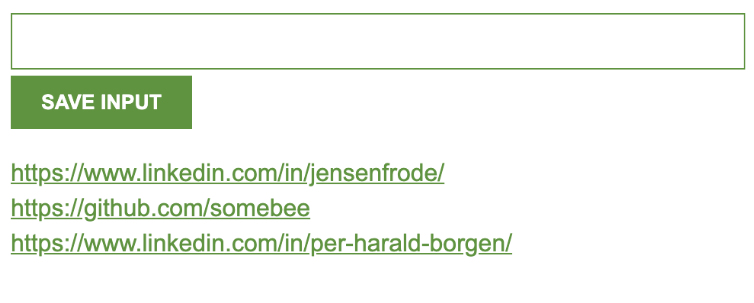

# Leads Tracker 📋


[](https://vitejs.dev/)
[](https://developer.mozilla.org/en-US/docs/Web/JavaScript)
[](https://github.com/bakadja/leads-tracker/pulls)
[](https://chrome.google.com/webstore)
[](https://github.com/bakadja/leads-tracker/graphs/commit-activity)

A powerful Chrome extension designed to save and manage website URLs with a single click. Perfect for sales professionals, researchers, digital marketers, or anyone who needs to track and organize multiple web resources efficiently.

<div align="center">
  
  <p><i>Leads Tracker in action - Easily save and access your important links</i></p>
</div>

## 📚 Table of Contents

- [✨ Features](#-features)
- [🚀 Quick Start](#-quick-start)
- [⚙️ Installation](#️-installation)
- [📖 Usage](#-usage)
- [🔧 Technology Stack](#-technology-stack)
- [👨‍💻 Development](#-development)
- [⚠️ Troubleshooting](#️-troubleshooting)
- [📝 Changelog](#-changelog)
- [🤝 Contributing](#-contributing)
- [📜 License](#-license)
- [👏 Acknowledgements](#-acknowledgements)
- [📬 Contact & Support](#-contact--support)

## ✨ Features

- **One-Click URL Saving**: Save the current tab's URL with a single click
- **Manual URL Entry**: Add any URL manually via the input field
- **Persistent Storage**: All your leads are safely stored in Chrome's local storage
- **Quick Access**: Access your saved leads through clickable links that open in new tabs
- **Bulk Management**: Delete all leads at once with a double-click when needed
- **Clean UI/UX**: Intuitive and minimalist user interface
- **Lightweight**: Minimal impact on browser performance
- **Offline Access**: View your saved leads even without an internet connection

## 🚀 Quick Start

1. Install the extension from the Chrome Web Store or load it locally
2. Click the Leads Tracker icon in your browser toolbar
3. Start saving URLs with the "SAVE TAB" button or enter URLs manually

## ⚙️ Installation

### From Chrome Web Store

1. Visit the [Chrome Web Store](#) (coming soon)
2. Click "Add to Chrome"
3. Confirm the installation

### From Source

1. Clone the repository:
   ```bash
   git clone https://github.com/bakadja/leads-tracker.git
   cd leads-tracker
   ```

2. Install dependencies:
   ```bash
   npm install
   ```

3. Build the project:
   ```bash
   npm run build
   ```

4. Load the extension in Chrome:
   - Open Chrome and navigate to `chrome://extensions/`
   - Enable "Developer mode" (toggle in the top-right corner)
   - Click "Load unpacked" and select the `dist` directory

### Development Setup

```bash
# Install dependencies
npm install

# Start development server
npm start
```

Visit localhost in your browser (the port will be displayed in the terminal).

## 📖 Usage

1. Click on the Leads Tracker extension icon in your browser toolbar
2. To save the current tab: Click "SAVE TAB"
3. To add a custom URL: Enter a URL in the input field and click "SAVE INPUT"
4. To visit a saved URL: Click on any saved URL to open it in a new tab
5. To delete all saved leads: Double-click the "DELETE ALL" button

## 🔧 Technology Stack

- **JavaScript (ES6+)**: Core programming language
- **Chrome Extension API**: For browser integration
- **HTML5/CSS3**: Front-end structure and styling
- **LocalStorage API**: For persistent data storage
- **Vite**: For development, bundling and optimization

## 👨‍💻 Development

This project uses [Vite](https://vitejs.dev/) for fast development and optimized builds. To learn more about configuring Vite, visit their [documentation](https://vitejs.dev/guide/).

### Project Structure

```
leads-tracker/
├── dist/               # Build output directory
├── node_modules/       # Dependencies
├── index.html          # Main HTML file
├── index.js            # JavaScript logic
├── index.css           # Styling
├── icon.png            # Extension icon
├── manifest.json       # Extension manifest
├── package.json        # Project configuration
├── LICENSE             # MIT license
└── README.md           # Project documentation
```

## ⚠️ Troubleshooting

- **Extension not appearing in toolbar**: Pin the extension by clicking the puzzle icon in your Chrome toolbar
- **URLs not saving**: Make sure you have granted the extension proper permissions
- **Changes not persisting**: Check if your browser has restrictions on local storage
- **Build errors**: Ensure you have the latest Node.js version installed

## 📝 Changelog

### v1.0.0 (Initial Release)
- Basic URL saving functionality
- Tab URL capture
- LocalStorage integration
- Delete all functionality

## 🤝 Contributing

Contributions are welcome! Please feel free to submit a Pull Request.

1. Fork the repository
2. Create your feature branch (`git checkout -b feature/amazing-feature`)
3. Commit your changes (`git commit -m 'Add some amazing feature'`)
4. Push to the branch (`git push origin feature/amazing-feature`)
5. Open a Pull Request

## 📜 License

This project is licensed under the MIT License - see the [LICENSE](LICENSE) file for details.

## 👏 Acknowledgements

- [Scrimba](https://scrimba.com) - Educational platform
- [Vite](https://vitejs.dev/) - Next generation frontend tooling
- [Chrome Extensions Documentation](https://developer.chrome.com/docs/extensions/) - Official guides

## 📬 Contact & Support

- Report issues on [GitHub Issues](https://github.com/bakadja/leads-tracker/issues)
- For questions, reach out via [GitHub Discussions](https://github.com/bakadja/leads-tracker/discussions)
- Follow [@bakadja](https://github.com/bakadja) for updates

---

## About Scrimba

At Scrimba our goal is to create the best possible coding school at the cost of a gym membership! 💜
If we succeed with this, it will give anyone who wants to become a software developer a realistic shot at succeeding, regardless of where they live and the size of their wallets 🎉
The Frontend Developer Career Path aims to teach you everything you need to become a Junior Developer, or you could take a deep-dive with one of our advanced courses 🚀

- [Our courses](https://scrimba.com/allcourses)
- [The Frontend Career Path](https://scrimba.com/learn/frontend)
- [Become a Scrimba Pro member](https://scrimba.com/pricing)

Happy Coding!